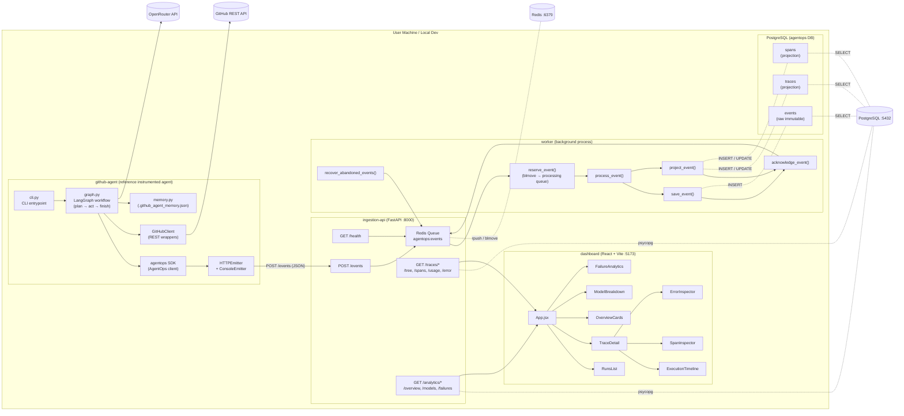
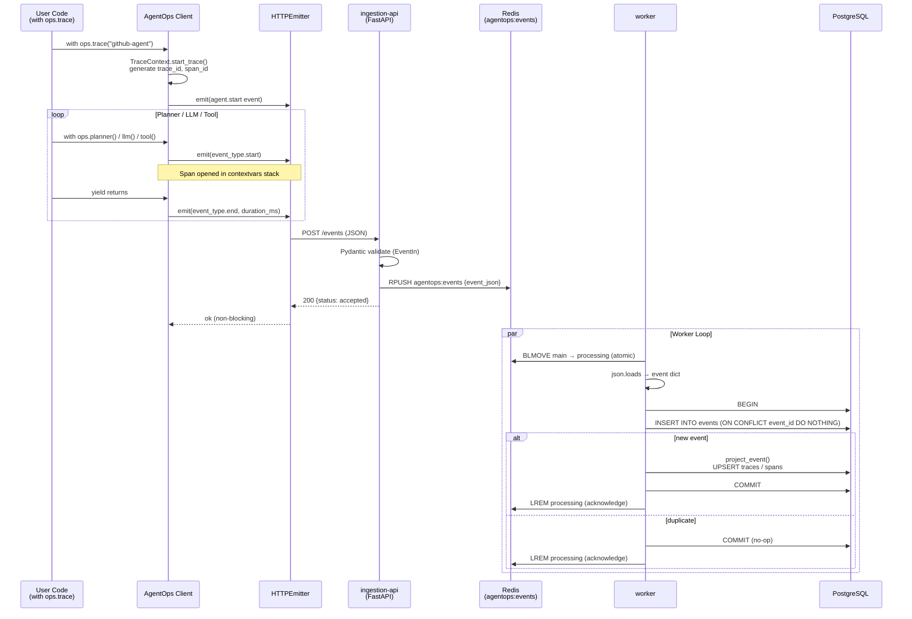
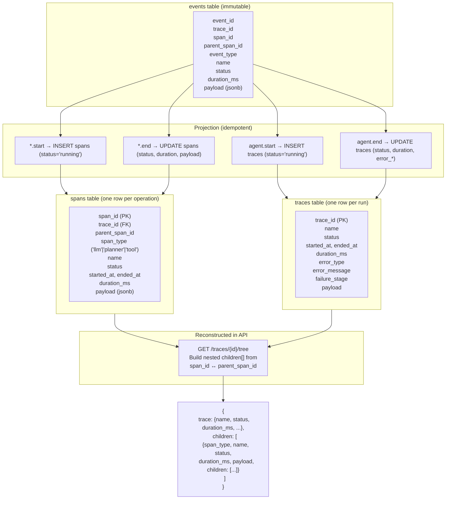
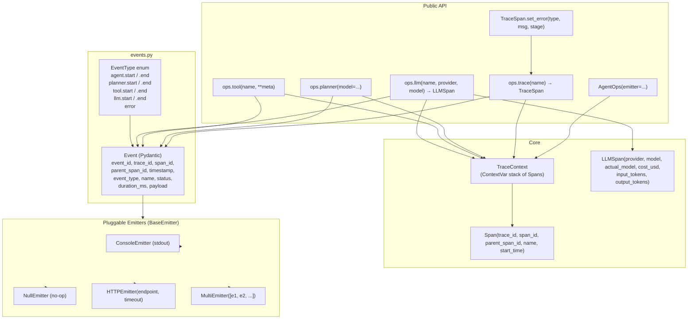
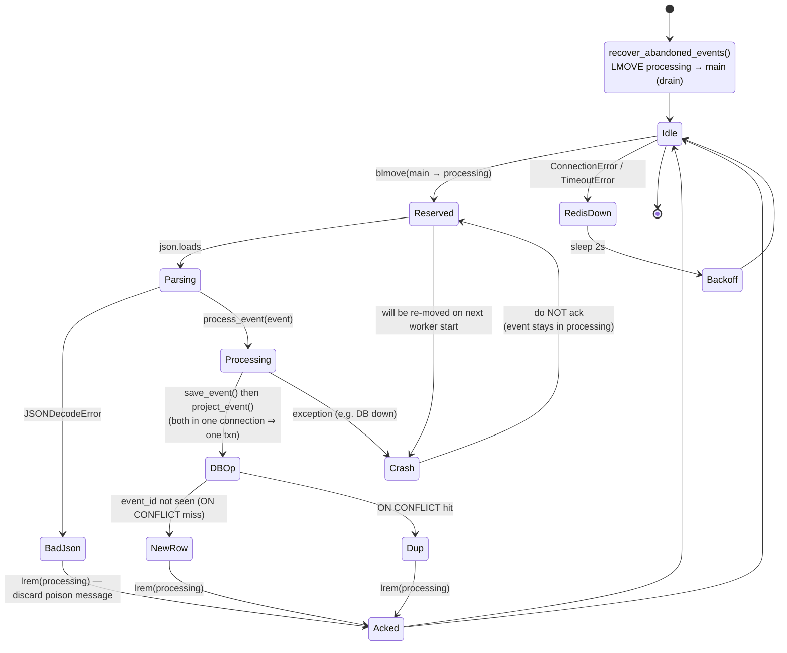

# AgentOps Prototype — Detailed Architecture

## Overview

AgentOps is a self-hosted observability platform for AI agents. It tracks the entire lifecycle of agent runs — from trace creation through planner reasoning, LLM calls, tool invocations, and the resulting tokens, cost, and failures — and exposes that data through a REST API and a React dashboard.

The project is a monorepo with 5 components:

- **agentops-sdk** — Python SDK embedded in user agents; emits events
- **ingestion-api** — FastAPI service that accepts and queues events
- **worker** — Background processor that persists events and updates projections
- **github-agent** — Reference implementation of a real instrumented agent
- **dashboard** — React/Vite frontend for visualizing traces

---

## Diagram 1: System-Level Architecture (End-to-End)

This shows how all five components connect and the data flow from a running agent to the UI.



---

## Diagram 2: Event Ingestion Pipeline (Hot Path)

This zooms into the asynchronous event pipeline. SDK writes are non-blocking because persistence happens in the worker.



Key properties:
- **Decoupled write** — SDK never waits on the DB
- **Idempotent** — `ON CONFLICT (event_id) DO NOTHING` makes retries safe
- **Reliable** — `blmove` into a processing queue guarantees an event is owned by exactly one worker
- **Recoverable** — `recover_abandoned_events()` requeues anything left in the processing queue at startup

---

## Diagram 3: Event Model & Trace Reconstruction

This is how raw events become a navigable trace tree.



Notes:
- The `traces` row is the root — it is the agent's outermost span
- `spans` carry the parent/child pointers
- `payload` is `jsonb` so any LLM/tool metadata is queryable without schema migrations

---

## Diagram 4: AgentOps SDK Internal Architecture

The SDK is the in-process instrumentation library. It owns span context and delegates actual delivery to pluggable emitters.



Key design points:
- **ContextVar-based span stack** — works across `asyncio` and threads without explicit passing
- **Single `_emit()` helper** — every public contextmanager funnels through it
- **Pluggable emitters** — `MultiEmitter` lets the github-agent log to console *and* POST to the ingestion API simultaneously
- **Mutable `LLMSpan`** — the caller can attach `set_usage()` and `set_response_metadata()` after the LLM responds, then the end event carries the final payload

---

## Diagram 5: GitHub Agent — LangGraph Workflow

The github-agent is a concrete example of an instrumented agent. It shows the planner/act/finish loop and how SDK events wrap each step.

```mermaid
flowchart TB
    START([User runs:<br/>github-agent 'task']) --> LOADMEM[memory.py:<br/>load .github_agent_memory.json]
    LOADMEM --> CTX[Build context prefix<br/>+ previous repo]
    CTX --> SETUP[Settings.from_env<br/>GitHubClient + AgentOps]

    SETUP --> ROOT([Trace start:<br/>ops.trace 'github-agent'])

    ROOT --> PLAN_NODE[plan node]

    PLAN_NODE --> RETRIEVE[ActionRetriever.retrieve<br/>tokenize task + last result<br/>score against registry<br/>top-k=8 candidates]
    RETRIEVE --> PROMPT[Build messages:<br/>SYSTEM_PROMPT + HumanMessage<br/>task, candidates, history, last_tool_result]
    PROMPT --> PLANNER_SPAN[ops.planner model=...]
    PLANNER_SPAN --> LLM_SPAN[ops.llm name= model= provider=OpenRouter]
    LLM_SPAN --> INVOKE[llm.invoke(messages)]
    INVOKE --> PARSE[_parse_json → thought, action, args, final_response]
    PARSE --> ROUTE{_route_after_plan}

    ROUTE -- "action = FINAL/NEED_INPUT<br/>or step ≥ max_steps" --> FINISH_NODE[finish node]
    ROUTE -- "otherwise" --> ACT_NODE[act node]

    FINISH_NODE --> NEED{action == NEED_INPUT?}
    NEED -- yes --> ASK[Set needs_input=true<br/>question, missing_inputs]
    NEED -- no --> FINAL[final_response]
    ASK --> TRACE_END
    FINAL --> TRACE_END([Trace end:<br/>ops trace context exits])

    ACT_NODE --> NORM[_normalize_action_name<br/>handle aliases]
    NORM --> ALLOWCHK{action in candidate set?}
    ALLOWCHK -- no --> SCRATCH_BAD[Append to scratchpad: ok=false]
    ALLOWCHK -- yes --> VALIDATE[_validate_action_args<br/>required, optional, coerce, extras]
    VALIDATE --> MISS{missing or errors?}
    MISS -- yes --> SCRATCH_BAD
    MISS -- no --> TOOL_SPAN[ops.tool name=action args=]
    TOOL_SPAN --> CALL[getattr(github_client, action)<br/>method(**validated_args)]
    CALL --> TRIM[_trim_result limit to 6 KB]
    TRIM --> SCRATCH_OK[Append to scratchpad: ok=true]
    SCRATCH_BAD --> LOOP_BACK
    SCRATCH_OK --> LOOP_BACK
    LOOP_BACK[step_count++, back to plan node]

    CALL -. HTTPS .-> GHE[(GitHub REST API)]
    INVOKE -. HTTPS .-> OR[(OpenRouter)]

    TRACE_END --> UPDMEM[update_memory_from_result<br/>persist last_repo]
    UPDMEM --> OUT[print final_response + scratchpad]
```

Important behaviors:
- **Single-action-per-step** — the model chooses one GitHub API call at a time
- **Validated args** — the registry's `ActionDefinition.required/optional` types are enforced before any HTTP call
- **Sandbox on candidates** — the model can only choose from the retrieved shortlist, never invent endpoints
- **Truncation** — list-style responses are trimmed to 20 items and 6 KB to fit the LLM context
- **Failure_stage tracking** — if the planner throws, the trace's `failure_stage='planner'` and `error_type/error_message` are captured; if any tool throws, the trace's `failure_stage='agent'` is set when the whole graph finishes

---

## Diagram 6: Dashboard Component Tree & API Wiring

The frontend is a single-page app with two views (run list, trace detail) and a clear mapping from REST endpoints to React components.

```mermaid
flowchart TB
    HTML[index.html] --> MAIN[main.jsx<br/>createRoot + StrictMode]
    MAIN --> APP[App.jsx<br/>State: traces, selectedTraceId,<br/>traceTree, traceUsage, overview,<br/>models, failures, traceError]

    subgraph VIEWS["Views (conditional in App.jsx)"]
        LISTVIEW[List View<br/>no selectedTraceId]
        DETAILVIEW[Detail View<br/>selectedTraceId set]
    end

    APP --> LISTVIEW
    APP --> DETAILVIEW

    subgraph LISTCOMP["List View Components"]
        OC[OverviewCards<br/>6 KPI tiles]
        MB[ModelBreakdown<br/>table by model]
        FA[FailureAnalytics<br/>run health + sources]
        RL[RunsList<br/>clickable rows]
    end

    subgraph DETAILCOMP["Detail View Components"]
        EI[ErrorInspector<br/>failure_stage / error_type / message]
        ET[ExecutionTimeline<br/>flattenTimeline rows<br/>horizontal bar per span]
        SN[SpanNode<br/>recursive tree node]
        SI[SpanInspector<br/>right-side panel<br/>timing / llm usage / payload]
    end

    LISTVIEW --> OC
    LISTVIEW --> MB
    LISTVIEW --> FA
    LISTVIEW --> RL

    DETAILVIEW --> EI
    DETAILVIEW --> ET
    DETAILVIEW --> SN
    DETAILVIEW --> SI

    subgraph API["src/api.js (all fetch to :8000)"]
        A1[getTraces → /traces]
        A2[getTraceTree → /traces/{id}/tree]
        A3[getTraceUsage → /traces/{id}/usage]
        A4[getOverview → /analytics/overview]
        A5[getModelBreakdown → /analytics/models]
        A6[getFailureAnalytics → /analytics/failures]
        A7[getTraceError → /traces/{id}/error]
    end

    APP -- "loadDashboard" --> A1
    APP -- "loadDashboard" --> A4
    APP -- "loadDashboard" --> A5
    APP -- "loadDashboard" --> A6
    APP -- "handleSelectTrace" --> A2
    APP -- "handleSelectTrace" --> A3
    APP -- "handleSelectTrace" --> A7

    A1 --> RL
    A4 --> OC
    A5 --> MB
    A6 --> FA
    A2 --> SN
    A3 --> ET
    A7 --> EI
```

---

## Diagram 7: REST API Surface

This is the complete public API exposed by the ingestion-api FastAPI service. All routes are mounted under `app.include_router(...)`.

```mermaid
flowchart LR
    subgraph OP["Operational"]
        H[GET /health]
        EI2[POST /events]
    end

    subgraph TRC["/traces/* (route file: app/routes/traces.py)"]
        T1[GET /traces?limit=50]
        T2[GET /traces/{trace_id}]
        T3[GET /traces/{trace_id}/spans]
        T4[GET /traces/{trace_id}/tree]
        T5[GET /traces/{trace_id}/usage]
        T6[GET /traces/{trace_id}/error]
    end

    subgraph ANA["/analytics/* (route file: app/routes/analytics.py)"]
        A1[GET /analytics/overview]
        A2[GET /analytics/models]
        A3[GET /analytics/failures]
    end

    subgraph DB["PostgreSQL"]
        DBT[(traces)]
        DBS[(spans)]
    end

    EI2 -- "RPUSH" --> REDIS[(Redis agentops:events)]
    H --> REDIS

    T1 --> DBT
    T2 --> DBT
    T3 --> DBS
    T4 --> DBT
    T4 --> DBS
    T5 --> DBS
    T6 --> DBT

    A1 --> DBT
    A1 --> DBS
    A2 --> DBS
    A3 --> DBT
    A3 --> DBS
```

Endpoint contracts:
- `/events` — only writes to Redis, never blocks
- `/traces` and `/traces/{id}` — read from the `traces` table
- `/traces/{id}/spans` and `/tree` — read from `spans` and build the tree in Python
- `/traces/{id}/usage` — aggregates `payload->>'input_tokens'`, `output_tokens`, `total_tokens`, `cost_usd` and `duration_ms` for `span_type = 'llm'`
- `/traces/{id}/error` — returns `status`, `failure_stage`, `error_type`, `error_message`
- `/analytics/overview` — total runs, success rate, avg duration, total LLM cost
- `/analytics/models` — group by `actual_model`/`provider`, with avg latency
- `/analytics/failures` — failed runs, failed spans, recovered runs, failure by span_type and span name

---

## Diagram 8: Worker Reliability & Recovery Model

The worker uses two Redis lists to provide at-least-once delivery and idempotency on the database side.



Idempotency stack:
1. **DB-level** — `events.event_id` is the primary key; `ON CONFLICT (event_id) DO NOTHING` makes a redelivery a no-op
2. **Projection-level** — `_start_trace/_start_span` use `ON CONFLICT DO NOTHING`; `_end_*` updates are pure `UPDATE WHERE span_id/trace_id = ...`
3. **Queue-level** — `blmove` removes from `agentops:events` before processing; the message only re-enters on crash
4. **Recovery-level** — `recover_abandoned_events()` runs at startup and requeues anything left in `agentops:events:processing`

---

## Component Summary

| # | Component | Tech | Role |
|---|---|---|---|
| 1 | `agentops-sdk` | Python 3.10+, pydantic, requests | In-process instrumentation. Exposes `AgentOps` with `trace`, `planner`, `tool`, `llm` context managers. Emits `Event` objects via pluggable `BaseEmitter` (Console / Null / HTTP / Multi). |
| 2 | `ingestion-api` | FastAPI, uvicorn, psycopg, redis-py | Stateless HTTP service. `POST /events` validates and pushes to Redis. `GET /traces/*` and `GET /analytics/*` read projected tables. CORS for `localhost:5173`. |
| 3 | `worker` | Python 3.14, redis-py, psycopg | Background consumer. `blmove` reserves events, `save_event` is idempotent, `project_event` updates `traces` and `spans`, then acks. Recovers abandoned events on startup. |
| 4 | `github-agent` | Python 3.11+, LangGraph, langchain-openai, requests | Reference agent. LangGraph `plan → act → finish` loop with JSON-planned actions, validated against a 40+ action registry retrieved via token overlap. Uses OpenRouter for free-tier LLM. Persists last-repo memory to `.github_agent_memory.json`. |
| 5 | `dashboard` | React 19, Vite 8, oxlint | SPA. Two views (run list, trace detail). Renders KPI cards, model breakdown, failure analytics, hierarchical span tree, execution timeline, and a right-side span inspector. |

## End-to-End Data Flow (one agent run)

```mermaid
flowchart LR
    A1[1. User runs github-agent 'task'] --> A2[2. LangGraph starts]
    A2 --> A3[3. plan node calls LLM]
    A3 --> A4[4. SDK emits llm.start / llm.end<br/>via HTTPEmitter]
    A4 --> A5[5. POST /events]
    A5 --> A6[6. RPUSH agentops:events]
    A6 --> A7[7. Worker blmove → processing]
    A7 --> A8[8. INSERT events (idempotent)]
    A8 --> A9[9. project_event: UPSERT traces / spans]
    A9 --> A10[10. LREM processing (ack)]
    A10 --> A11[11. Next plan/act cycle]
    A11 --> A12[12. Trace completes → agent.end]
    A12 --> A13[13. User opens dashboard at :5173]
    A13 --> A14[14. React fetches /traces, /analytics/*, /traces/{id}/tree, /usage, /error]
    A14 --> A15[15. UI renders runs, KPIs, tree, timeline, inspector]
```

This is the full picture: an instrumented agent (github-agent) calls the SDK, which POSTs to the ingestion API, which queues to Redis, which the worker drains into PostgreSQL as both raw events and projected traces/spans, which the dashboard reads back through the same ingestion API to render the observability UI.
