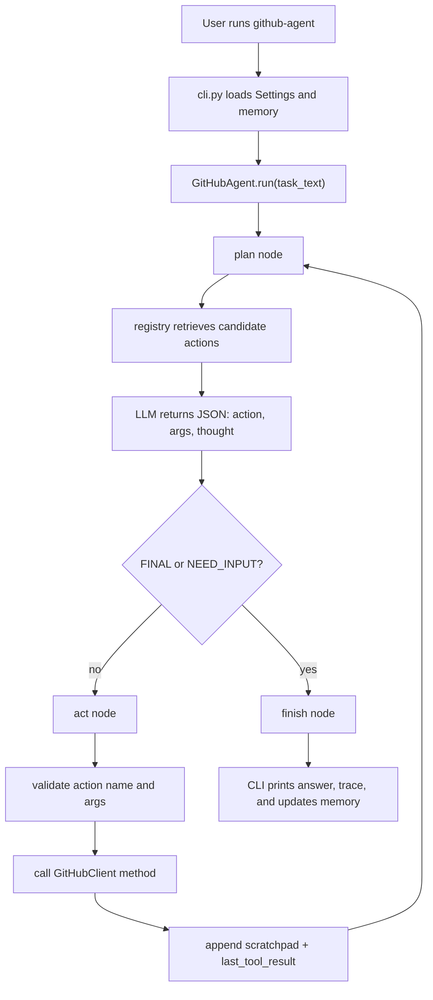

# GitHub Agent Memory

This file is the living architecture memory for the project. Update it whenever the agent's behavior, modules, assumptions, or tradeoffs change.

## Project In One Line

`github-agent` is a local Python CLI agent that turns a natural-language GitHub task into a small sequence of validated GitHub REST API calls, using OpenRouter for planning and LangGraph for the plan/act loop.

## Current Shape

The codebase is intentionally compact:

- `github_agent/cli.py` is the user-facing command line entrypoint.
- `github_agent/config.py` loads credentials and runtime settings from `.env` or the environment.
- `github_agent/graph.py` contains the LangGraph agent loop, planner prompt, validation, execution, retries, progress events, and finalization.
- `github_agent/registry.py` defines every action the model may choose and retrieves a small candidate set for each task.
- `github_agent/github_api.py` wraps GitHub REST endpoints behind Python methods.
- `github_agent/memory.py` stores tiny follow-up context in `.github_agent_memory.json`.
- `README.md` documents setup, usage, and the high-level design.

Current supported action families:

- User/repository inspection and creation.
- Repository contents and branches.
- Issues: list, create, update, close/reopen, comment, label, and assign.
- Pull requests: list, inspect, update, create, merge, request reviewers, review, inline comment, diff, and patch.
- Checks/actions status.
- Search/discovery across code, repositories, issues/PRs, commits, users, and organizations.
- Git data APIs for refs, blobs, trees, and commits.
- Composite branch and multi-file commit workflows.

Generated/local artifacts:

- `github_agent.egg-info/` is packaging metadata from editable install.
- `__pycache__/` folders are Python bytecode caches.
- `.github_agent_memory.json` is runtime memory, not source.
- `thought.json` is a saved example run/scratchpad, useful for understanding behavior but not imported by the app.
- `api.github.com.2022-11-28.json` appears to be a local GitHub OpenAPI/spec snapshot.
- `scripts/convert_heic_to_jpg.py` is a separate utility script and not part of the agent runtime.

## Runtime Flow

## Core Architecture Decisions

### 1. One explicit action per loop

The graph is `plan -> act -> plan -> ... -> finish`. The planner does not directly call arbitrary tools. It emits JSON with one action and one argument object, and then Python decides whether that action is allowed and valid.

Why we did this:

- It keeps behavior debuggable. Every action appears in the scratchpad/action trace.
- It reduces risk for write operations because only one API call happens at a time.
- It makes failures recoverable. If a GitHub call fails, the next planning step sees the error and can adapt.
- It is easier to extend than a hidden tool-calling setup because all available actions are visible in `registry.py`.

### 2. Registry plus retrieval instead of one huge prompt

`registry.py` defines `ActionDefinition` objects with name, description, required args, optional args, keywords, and examples. `ActionRetriever` tokenizes the task and returns the top candidate actions.

Why we did this:

- As the API list grows, putting every endpoint into every prompt would waste context and confuse the model.
- A shortlist makes planning more deterministic because the model is told to choose only from relevant actions.
- The registry becomes the single contract between natural-language planning and executable Python methods.
- New actions can be added by pairing a `GitHubClient` method with an `ActionDefinition`.

### 3. The LLM plans, Python enforces

The model is asked to return strict JSON, but `graph.py` still parses defensively, normalizes known aliases, checks the action against the retrieved candidates, validates required/optional arguments, coerces primitive types, rejects unexpected fields, and only then calls GitHub.

Why we did this:

- LLMs sometimes return malformed JSON, synonyms, extra fields, or guessed arguments.
- Validation creates a hard boundary before network side effects.
- Type coercion lets natural model output like `"42"` become an integer without making the GitHub wrapper messy.
- Explicit missing-input handling lets the agent ask the user instead of hallucinating owner/repo/path values.

### 4. Small reversible operations first

The system prompt tells the model to prefer small, reversible API actions. Write capabilities now include issue updates, PR updates/merges/reviews, branch creation, single-file content writes, and grouped multi-file commits.

Why we did this:

- GitHub automation can cause real remote side effects.
- Single-file `PUT /contents` is still best for simple edits.
- `create_multi_file_commit` uses lower-level refs/blobs/trees/commits when changes need to land together.
- Composite helpers keep common workflows ergonomic while preserving the low-level API methods for explicit control.

### 5. LangGraph is used for control flow, not complexity

The graph has only three nodes: `plan`, `act`, and `finish`. The state stores the original task, candidates, scratchpad, next action, last result, final response, missing-input status, and step counters.

Why we did this:

- LangGraph gives a clean state-machine structure while keeping the project understandable.
- The max-step counter prevents runaway loops.
- The scratchpad provides traceability and model context across steps.
- Progress callbacks let the CLI show live status without coupling terminal printing to the graph logic.

### 6. CLI owns interaction and persistence

`cli.py` creates settings, the GitHub client, and the agent. It prints progress events to stderr, prints the final answer to stdout, supports `--json`, handles clarification loops, and updates local memory after successful runs.

Why we did this:

- The agent core stays reusable outside the terminal later.
- Interactive clarification belongs at the boundary where a human can type an answer.
- `--json` is useful for debugging because it exposes the full LangGraph result.
- Keeping progress on stderr keeps stdout usable for the final response or JSON output.

### 7. Memory is intentionally tiny

`memory.py` only remembers the last successfully referenced repository as `owner/repo`, then prepends that as conversation context on the next CLI run.

Why we did this:

- It solves the common follow-up case: "what files are in that repo?"
- It avoids building a complex memory system before we need one.
- It keeps memory inspectable and editable in `.github_agent_memory.json`.
- It only updates from successful tool results, so failed guesses do not poison future context.

## Important Files And Responsibilities

### `github_agent/config.py`

- Loads `.env` immediately via `load_dotenv()`.
- Requires `GITHUB_TOKEN` and `OPENROUTER_API_KEY`.
- Provides defaults for GitHub API base URL, OpenRouter base URL/model, OpenRouter metadata headers, and `AGENT_MAX_STEPS`.

Key point: settings validation happens before any agent or GitHub client is created, so missing credentials fail fast.

### `github_agent/github_api.py`

- Owns the `requests.Session` and GitHub headers.
- Adds `Accept`, bearer token auth, `X-GitHub-Api-Version: 2022-11-28`, and a local user agent.
- Centralizes HTTP error handling in `_request`.
- Uses `_request_text` for PR diff/patch endpoints that return non-JSON content.
- Decodes base64 file contents for `get_contents`.
- Encodes content for `put_contents`.
- Provides both direct REST wrappers and composite helpers such as `create_branch` and `create_multi_file_commit`.

Key point: this layer should stay boring. It should map Python methods to GitHub REST calls without agent reasoning.

### `github_agent/registry.py`

- Contains the executable action catalog.
- Defines required and optional argument schemas.
- Adds keywords/examples to improve retrieval.
- Formats candidate actions for the planner prompt.

Key point: if the model should be allowed to call something, it must be represented here and implemented on `GitHubClient`.

### `github_agent/graph.py`

- Defines the planner JSON contract in `SYSTEM_PROMPT`.
- Parses and repairs model JSON responses where possible.
- Retrieves candidate actions using task text, the last tool result, and recent scratchpad actions.
- Builds the `plan -> act -> finish` LangGraph.
- Validates actions/args before execution.
- Coerces primitive values and JSON/list values for labels, assignees, reviewers, tree entries, parent SHAs, and multi-file changes.
- Trims large tool results before putting them back into model context.
- Emits progress events for the CLI.
- Handles provider retries during planning.

Key point: this is the brain and the safety gate. Most behavior changes should be made here or in `registry.py`.

### `github_agent/cli.py`

- Defines the `github-agent` command.
- Wires together settings, `GitHubClient`, `GitHubAgent`, memory, and progress printing.
- Runs clarification rounds when the graph returns `NEED_INPUT`.
- Saves updated memory after a completed run.
- Prints a simple action trace after the final response.

Key point: this is the app shell. Keep terminal UX here, not in the graph or API client.

### `github_agent/memory.py`

- Reads/writes `.github_agent_memory.json`.
- Builds a short "Conversation memory" prefix.
- Extracts `last_repo` from successful action args or GitHub response payloads.

Key point: memory is deliberately narrow. Add new memory fields only when there is a repeated follow-up workflow that needs them.

## How To Add A New GitHub Capability

1. Add a method on `GitHubClient` in `github_agent/github_api.py`.
2. Add an `ActionDefinition` in `ACTION_REGISTRY` with exact method name, description, required args, optional args, keywords, and examples.
3. Make sure the method's parameter names match the registry argument names.
4. If the result is huge, add trimming logic to `_trim_result` in `github_agent/graph.py`.
5. If the CLI trace should be friendlier, add a branch to `_summarize_result`.
6. Test with `github-agent "<natural language task>" --json` so the scratchpad is visible.

## Known Gaps / Future Work

- There are currently no automated tests in the repo.
- Git worktree ownership is unusual: `git rev-parse --show-toplevel` points to `/Users/shivamshrivastava`, not this project folder. Be careful with repo-wide git commands.
- The package description in `pyproject.toml` still says "Ollama", while the README and current code use OpenRouter.
- `github_agent.egg-info/` and `__pycache__/` are checked/present locally; consider ignoring generated artifacts if this becomes a cleaner repo.
- Multi-file repository edits are now implemented through `create_multi_file_commit`, but they are not yet wrapped in a user confirmation flow.
- Pagination is only lightly exposed through parameters like `per_page` and `page`; the agent does not yet auto-page complete result sets.
- GitHub search, actions, and checks responses can be large; trimming protects context but can hide details unless the agent asks narrower follow-up calls.
- The memory system still only remembers the last repo; remembering last issue, PR, and branch would make follow-up tasks more natural.
- There is no dedicated confirmation layer yet for high-impact operations such as merging PRs, closing issues, force-moving refs, or committing many files.

## Current Mental Model

Think of the project as three concentric rings:

- Outer ring: `cli.py` handles humans, terminal output, clarification, and persistent local context.
- Middle ring: `graph.py` handles agent reasoning, state, validation, loop control, and safety.
- Inner ring: `github_api.py` performs actual GitHub HTTP requests.

`registry.py` is the contract between the middle and inner rings. It tells the model what exists, tells validation what arguments are legal, and tells future developers where to extend the action surface.
